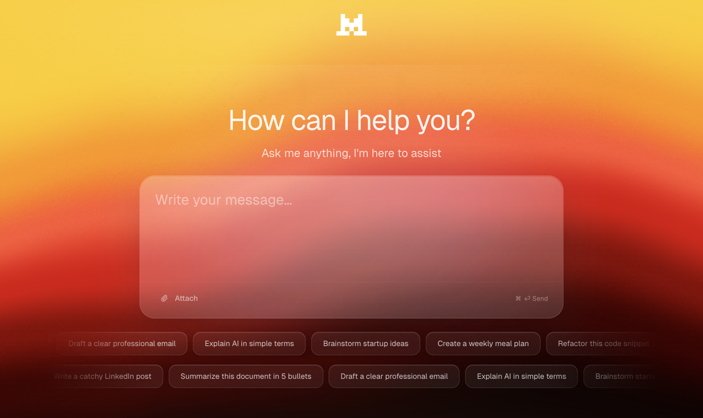
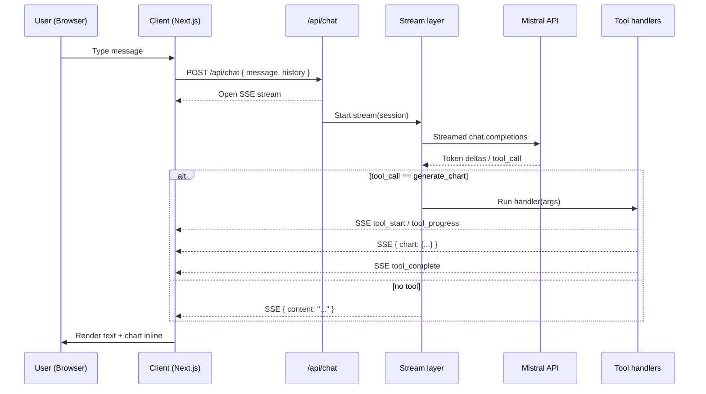
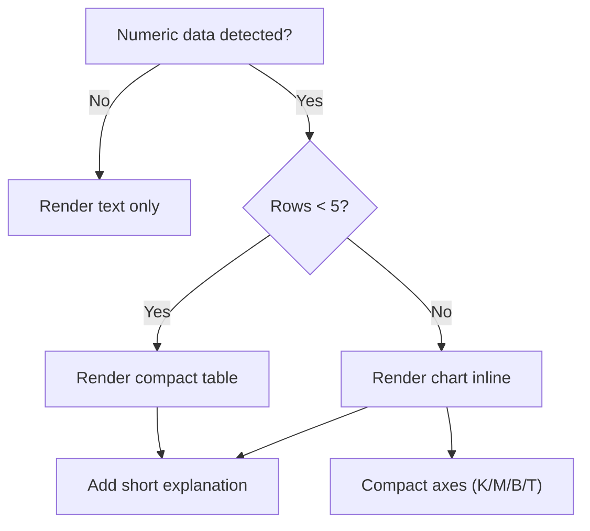

<p align="center">
  
</p>

<h2 align="center">Le Chat V2 — Mistral chat with inline charts</h2>

<p align="center">
  
</p>

<p align="center">
  A tiny, modern chat app powered by Mistral that can render charts directly in the conversation.
  <br/>
  Built as a friendly, non‑commercial application for my SWE Mistral internship application.
</p>

<p align="center">
  <a href="public/resume.pdf"></a>
  <a href="https://www.linkedin.com/in/yacine-alloul-96295a229/"></a>
  <a href="https://x.com/0xmilliounaire"></a>
</p>

### Disclaimer
This project is not commercial. It’s only for my internship application and a suggestion for refreshed branding and new features — like rendering charts directly inside the chat (no more static matplotlib images).

### Why I built this
- I love the Liquid Glass UI aesthetic, so I built this Le Chat V2 in that style for my Mistral hometask — I’m convinced this look is the next UI wave.
- I’m applying to the SWE internship at Mistral and wanted to show product taste, clean code, and a tiny “tool use” demo.
- I love the idea of “Le Chat” that can not only talk but also visualize data when it’s helpful.
- The issue: to render charts in Le Chat or even ChatGPT, you often have to run Python to generate a matplotlib image — which doesn’t make sense for a lightweight, web‑first chat.
---

### Problem → Solution → Explanation

- **Problem**: Ask “What is the GDP of France from 2005 to 2025?” and many chat UIs will either dump a long static table or generate Python you must run to get a matplotlib image. That breaks the web flow and is heavy for a lightweight chat.
- **Solution**: Web‑first inline charts. The model emits a structured chart spec via tool use; the client renders it instantly inside the conversation. No Python, no external image pipeline.
- **Explanation**: We stream tokens and tool events (SSE). When a chart is requested, the server sends a `{ chart: ... }` payload the UI renders inline. Small datasets become compact tables; larger ones prefer charts; axes can be compact (K/M/B/T).

---

### Highlights
- Minimal, responsive UI with a small playful touch (my cat says hi 👋).
- Streaming responses (SSE) from the server for snappy UX.
- Inline charts in the conversation via a function‑calling “tool”.
- Smart rules: use a table if there are <5 rows; otherwise prefer a chart. Axes can display K / M / B / T for readability.
- LocalStorage conversations with a simple sidebar.

---

### Architecture at a glance
- `app/api/chat/route.ts`: very thin HTTP layer; starts the SSE stream and delegates.
- `lib/ai/stream.ts`: bridges Mistral’s streamed deltas to frontend SSE events; dispatches tool calls.
- `lib/ai/tools/index.ts`: tool declarations (JSON schema for arguments).
- `lib/ai/tools/handlers.ts`: server‑side handlers for tools (e.g., generate_chart).
- `lib/ai/prompt.ts`: the system prompt, centralized and easy to edit.
- `lib/ai/conversation.ts`: maps/filters previous messages into the LLM format.
- `lib/ai/client.ts` + `lib/env.ts`: configured Mistral client and env access.
- `lib/sse.ts`: tiny helpers to send consistent SSE messages.
- Frontend chat: `components/chat/*` (stream reader, UI, charts, and tool feedback).

---

### Architecture flow (diagram)



### Decision rule (table vs chart)



---

### How the inline chart feature works (step‑by‑step)
1) The user types a message in the chat (`components/chat/chat-input.tsx`).
2) The client posts to `/api/chat` with the message and the recent conversation.
3) The server builds the system prompt (`lib/ai/prompt.ts`) and formats the history (`lib/ai/conversation.ts`).
4) We call Mistral with streaming enabled. As tokens arrive, we forward them to the browser via SSE as `{ content }` events.
5) If Mistral decides to use a tool (here: `generate_chart`), we receive a function call with JSON arguments.
6) We run the matching handler (`lib/ai/tools/handlers.ts`), which can:
   - send `tool_start` and `tool_progress`,
   - send a `{ chart: {...} }` payload with the ready‑to‑render spec,
   - then send `tool_complete` (and optionally hide it from the UI later).
7) The frontend listens to these SSE events and updates the UI: the chart appears in the flow next to the assistant’s message.

The system prompt enforces a simple decision rule:
- If the numeric data has fewer than 5 rows → make a small table.
- If it has 5 rows or more → prefer a chart instead of a long table.
- Always add a short natural‑language explanation around the visualization.
- Axes can be compact (K, M, B, T).

---

### Features built for this demo
- Inline chart tool: context‑aware chart generation directly in chat (no external image generation).
- Minimal “promo” card: a centered, tasteful card with my cat image, a short message, and quick CTAs.

---

### Local development
1) Install dependencies
```bash
npm i
```

2) Configure env
```bash
cp .env.local.example .env.local # if you create an example file
# then set your key in .env.local
# MISTRAL_API_KEY=your_key_here
```

3) Run the app
```bash
npm run dev
```

App runs on `http://localhost:3000`.

---

### Configuration you might care about
- Edit the system prompt: `lib/ai/prompt.ts`.
- Change tool behavior/schemas: `lib/ai/tools/index.ts` and `lib/ai/tools/handlers.ts`.
- Adjust history trimming: `lib/ai/conversation.ts` (currently `slice(-40)`).
- Next.js config hint to silence monorepo warnings: `next.config.ts` (`experimental.outputFileTracingRoot`).

---

### Roadmap ideas (if I had more time)
- Zod validation for tool arguments and incoming payload.
- Token‑aware history trimming.
- A few more tools (web search, file parsing, etc.), each with its own handler.
- Proper telemetry and leveled logs (info/warn/error) with production toggle.
- Add other models (GPT 5, Claude, GROK...).

---

### CTAs
- My CV: [Open CV](public/resume.pdf)
- LinkedIn: [linkedin.com/in/yacine-alloul-96295a229](https://www.linkedin.com/in/yacine-alloul-96295a229/)
- X (Twitter): [x.com/0xmilliounaire](https://x.com/0xmilliounaire)

If you enjoyed this, a repost on X would mean a lot and could help me to get the SWE internship. Merci 🙏